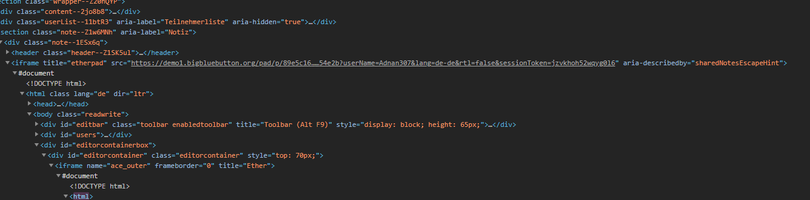

# BigBlueButton-Hack
A method to bypass the locked shared notes

# How is it working
With this method you can bypass the blocking before the shared notes get locked.
You go in the room and inspect the shared notes. You need to search for a iframe tag with the title "etherpad".
Take the link and paste it in a new tab.

Now u copy the link and open the etherpad in a new tab. After that you will be logged out in the shared notes in ur BBB Meeting. 
When the moderator lock the shared notes you will be able to write in the shared notes. This is possible because the shared notes are 
a imported etherpad and the moderator take away the permission to write in the the etherpad from the meeting. When you have direct access he cant take away any permissions.
When the share notes are locked u cant bypass the id changes to "r....." and this id is only for reading the etherpad. 
The id is random generated you cant find any encryption for it.

